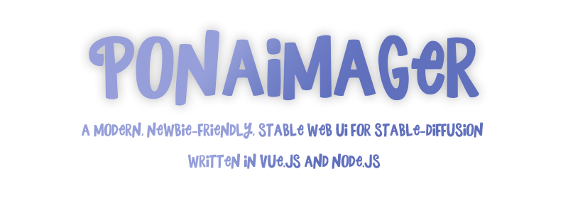

     
    
     

### WARN: Under heavy development, please do not use in production environments.

A web UI for Stable Diffusion similiar to [stable-diffusion-ui](https://github.com/AUTOMATIC1111/stable-diffusion-webui) but with a modern design _and much LESS options because I am a noob and I don't know what does they do.

### Features

- Modern material design, robust user interface, fine-tuned website for fast loading speed (400KiB~ data transmitted without cache on loading)
- Highly customizable through config.json, should be compatible with most models trained with Stable Diffusion pipeline.
- Easy to set up & launch without any programming skills needed (but you should be familiar with command lines which is fairly easy)
- PWA Support! You may install this as a desktop app for a better experience.
- More to come

Refer to [the wiki](https://github.com/GrieferPig/PonAImager-WebUI/wiki/) for installation guide & more

Demo (Under maintenance): [available here](https://ponaimager.top/), 503 = server fked up, __*plz do not ddos ty*__

Model used in demo: [AstraliteHeart/pony-diffusion](https://huggingface.co/AstraliteHeart/pony-diffusion)

国人建议使用[china.ponaimager.top](http://china.ponaimager.top)以获得最佳速度

# License info

TODO: copy to wiki

(Adapted from [pony-diffusion](https://huggingface.co/AstraliteHeart/pony-diffusion))

## License

This model is open access and available to all, with a CreativeML OpenRAIL-M license further specifying rights and usage. The CreativeML OpenRAIL License specifies:

- You can't use the model to deliberately produce nor share illegal or harmful outputs or content
- The authors claims no rights on the outputs you generate, you are free to use them and are accountable for their use which must not go against the provisions set in the license
- You may re-distribute the weights and use the model commercially and/or as a service. If you do, please be aware you have to include the same use restrictions as the ones in the license and share a copy of the CreativeML OpenRAIL-M to all your users (please read the license entirely and carefully) [Please read the full license here](https://huggingface.co/spaces/CompVis/stable-diffusion-license)

## Downstream Uses

This model can be used for entertainment purposes and as a generative art assistant.

## Disclaimer

Font used: A New Adventure, Hasbro Inc, Adapted by EveryDayDashie
Icon: Adapted from derpibooru.org
I own absolutely nothing here except for the source code of this website. You may contact me for a take down request if you are the respective content owner.
